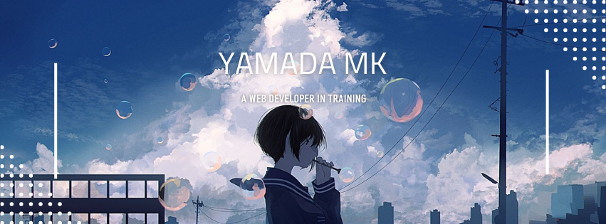

    

        
    

    
Hi! I'm a web development student with a passion for crafting scalable, user-friendly web applications that captivate users from the first click. I’m constantly exploring new technologies and frameworks, driven by a love for innovation and problem-solving.

    <h1></h1>

 

 

- 🔭 I’m currently studying to **become a web developer**.

- 🌱 I'm diving deep into competitive coding platforms to sharpen my algorithm analysis skills, primarily using **Python** and **JavaScript**.

- 🔍 Take a look at my projects on [**Frontend Mentor**](https://www.frontendmentor.io/profile/yamadaMk12)!

- 📫 How to reach me: **kite.kun555@gmail.com**.

  

## 🌐 My Journey:  

- 💻 Master **React** and **Next.js** to build highly dynamic and SEO-friendly web applications.  
- 📊 Learn advanced state management techniques using **Redux** and **Context API**.  
- 🌍 Understand **RESTful APIs** and explore **GraphQL** for more efficient data fetching.  
- 🛠️ Gain hands-on experience with **Tailwind CSS** for rapid UI design and development.  

## 🚀 My Goals:  

- 🔍 Dive deeper into **performance optimization techniques** to make websites load faster.  
- 🌱 Learn and implement **progressive web app (PWA)** features for a better user experience.  
- 💾 Explore **database technologies** like **MongoDB** and **PostgreSQL** for back-end development.  
- 🖥️ Build responsive and mobile-first designs using **CSS Grid** and **Flexbox**.  

## 🎨 Web Design & Development:  

- 🖌️ Master modern **UI/UX principles** to design intuitive and beautiful interfaces.  
- 🌐 Enhance skills in **web accessibility** to ensure inclusivity for all users.  
- 🚦 Implement robust **error handling** and debugging practices for smoother experiences.  
- 🛡️ Focus on **web security fundamentals**, including HTTPS, CORS, and content security policies.  

##  
 

<h1>📫 Contact Me</h1> 

Feel free to reach out or check out my profiles!  

&nbsp;
&nbsp;
&nbsp;
&nbsp;

<h2 align="center">📊 Github Stats</h2>

 

<h2 align="center">🛠️ Languages and Tools</h2>

<b>Frontend</b>

 

&nbsp;
&nbsp;
&nbsp;
&nbsp;
&nbsp;
&nbsp;

<b>Backend</b>

 

&nbsp;
&nbsp;
&nbsp;
&nbsp;
&nbsp;

<b>Tools and Platforms</b>

 

&nbsp;
&nbsp;
&nbsp;

 

<h2 align="center">👨‍💻 More About Me on GitHub</h2>

    
<b>🏆 Github Trophies</b>

     
    

        
    

<b>🔥 Streak Stats</b>

 

<b>⚡ Github Public Stats</b>

 

    
    
    
    
    

<h6 align="center">Show ❤️ by 🌟 my repositories!</h6>
