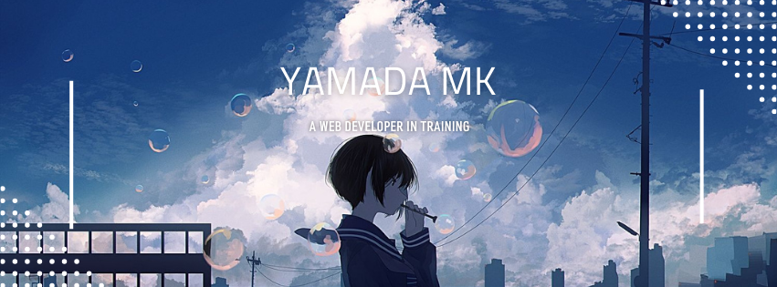

    

        
    

    
Hi! I'm a web development student with a passion for crafting scalable, user-friendly web applications that captivate users from the first click. I’m constantly exploring new technologies and frameworks, driven by a love for innovation and problem-solving.

    <h1></h1>

 

    

        
    

    
- 🔭 I’m currently studying on **becoming a web developer**.

    
- 🌱 I'm diving deep into competitive coding platforms to sharpen my algorithm analysis skills, primarily using Python and Javascript**.

    
- 🔠Take a look at my projects on [**Frontend Mentor**](https://www.frontendmentor.io/profile/yamadaMk12)!.

    
- 📫 How to reach me: **kite.kun555@gmail.com**.

    
- 👯 I’m looking to collaborate on **developing new open-source projects**.

    
- 🌠Fluent in **Arabic** 📖, and polishing up my **English** skills every day 🌟

    <h1></h1>

## 🏆 Goals:

- 🚀 Gain experience in developing full-stack applications using **React** and **Node.js**.
- 🌐 Improve my knowledge of web accessibility standards and incorporate them into my projects.
- 🎨 Learn new design techniques and tools to enhance my UI/UX design skills.

    
<b>🆠Github Trophies</b>

     
    

        
    

